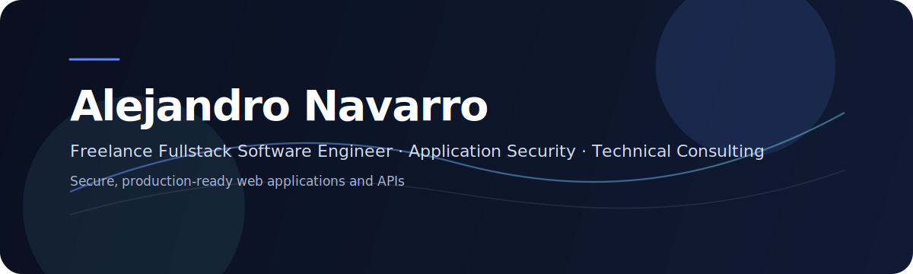

  
   
   
  <h1>Alejandro Navarro</h1>
  
<strong>Freelance Fullstack Software Engineer</strong> · <strong>Application Security</strong> · <strong>Technical Consulting</strong>

  

    I build secure, production-ready web applications and APIs with a strong focus on quality, maintainability, and security.
  

  

    <em>Available for freelance engagements and selective full-time opportunities.</em>
  

  
  
  

---

## What I Do

- Build fullstack web applications with Next.js and NestJS
- Design and secure REST APIs
- Work with PostgreSQL, Redis, Docker, and CI/CD workflows
- Apply secure development practices aligned with OWASP
- Support clients from architecture to deployment

---

## Services

- Productive web app delivery for startups and small teams
- API and backend implementation with secure defaults
- Security reviews for authentication, authorization, and input handling
- Architecture support for maintainable systems
- Technical consulting for web platforms and deployments

---

## Core Focus

- Secure web development
- Application Security
- API design and validation
- Authentication and authorization
- Cloud-ready deployment

---

## Tech Stack

  

---

## Selected Work

| Project                                                       | Description                                                                                     | Stack                                |
| ------------------------------------------------------------- | ----------------------------------------------------------------------------------------------- | ------------------------------------ |
| [Pinceles y Acrílico](https://pinceles-acrilico.netlify.app/) | One-page site for a nail studio focused on services, trust, and WhatsApp bookings.              | Astro, Tailwind, TypeScript          |
| [Timora](https://timora.nvbale.dev/)                          | Time tracking and reporting app for freelancers and small teams with billing-focused workflows. | Next.js, React, TypeScript, Prisma   |
| [Muebles San Francisco JYN S.A.](https://www.mueblesjyn.com/) | Bilingual corporate website and catalog for a custom furniture business in Costa Rica.          | Next.js, React, TypeScript, Tailwind |
| [Internal Operations Platform](#)                             | Internal system for project tracking, payments, deliveries, and access control.                 | Next.js, React, TypeScript, Prisma   |
| [Furniture E-commerce Platform](#)                            | Furniture e-commerce platform with admin tools, checkout, inventory, and a public catalog API.  | Next.js, React, TypeScript, Prisma   |
| [navarro-works](https://nvbale.dev/)                          | Bilingual personal landing focused on digital solutions, SEO, and direct contact.               | Astro, Tailwind, TypeScript          |

---

## Approach

I help build software that is not only functional, but also well-structured, secure, and easy to maintain.

My background in backend engineering, networking, and cybersecurity helps me think beyond features and into risk, reliability, and long-term quality.

---

## Contact

If you're looking for a consultant for a web platform, API, or security-focused project, let's talk.

  
  

